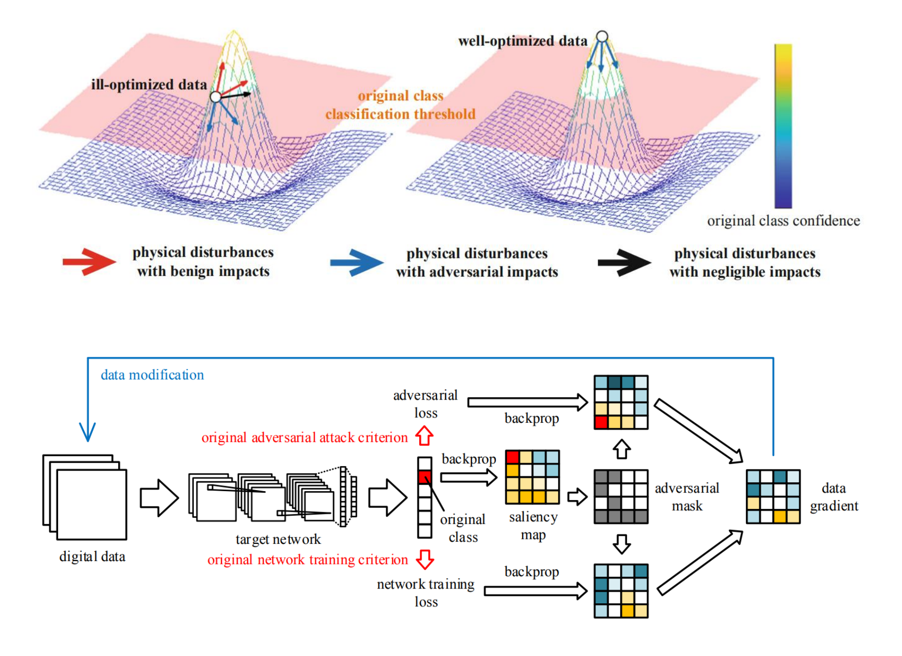

# P-ALPhA

<div align="center">
    
</div>

## Overview

The PyTorch implementation of our paper:
> Chenchen Zhao, and Hao Li. Condition-Invariant Physical Adversarial Attacks via Pixel-Wise Adversarial Learning. International Conference on Neural Information Processing 2021 <br>
> [[paper](https://link.springer.com/chapter/10.1007/978-3-030-92270-2_32)] [[learn more]()]

We propose a physical adversarial attack method that maintains high robustness against multiple simulated real-world disturbances (e.g. imbalanced illumination, long distances, noise in capturing, etc). The model reaches state-of-the-art physical attack performance, and is the first one to propose the concept of pixel-wise adversarial learning in adversarial attacks

*1.5 years later...*
- Rewrite the code

## Usage

Run `conda env create -f environment.yaml && conda activate palpha` to create and activate a conda virtual environment named `palpha`

Run `python main.py attack` to conduct P-ALPhA on a pretrained classifier

Run `python main.py test` to validate the performance of the model against different simulated real-world disturbances

Modify `args.py` for customized experimental settings

Modify `model.py` for customized classifier

> This project does not include classifier-training scripts. Pre-train a classifier, and replace `model.py` with customized classifier definition. The classifier should only have logits as output

## Performance

| ResNet18 | Success rate % | Illumination % | Distances % | Errors % |
| --- | --- | --- | --- | --- |
| PGD & P-ALPhA | **100.0** | 98.0 | **100.0** | **91.8** |
| PGD | 100.0 | 6.07 | 4.49 | 3.34 |
| EoT <sup>[1](#eot)</sup> | 16.0 | 40.5 | 87.3 | 77.9 |
| C&W & P-ALPhA | 100.0 | **99.0** | 79.6 | 59.2 |
| C&W | 100.0 | 92.9 | 75.5 | 30.6 |

| VGG16 | Success rate % | Illumination % | Distances % | Errors % |
| --- | --- | --- | --- | --- |
| PGD & P-ALPhA | 99.0 | **95.9** | **100.0** | **74.5** |
| PGD | 100.0 | 8.08 | 6.06 | 12.1 |
| EoT <sup>[1](#eot)</sup> | 50.5 | 12.0 | 54.0 | 12.0 |
| C&W & P-ALPhA | **100.0** | 39.4 | 53.5 | 11.1 |
| C&W | 100.0 | 33.3 | 53.5 | 13.1 |

## BibTeX
```bibtex
@inproceedings{zhao2021condition,
  title={Condition-Invariant Physical Adversarial Attacks via Pixel-Wise Adversarial Learning},
  author={Zhao, Chenchen and Li, Hao},
  booktitle={International Conference on Neural Information Processing},
  pages={369--380},
  year={2021},
  organization={Springer}
}
```

## References
<div id="eot"></div>
[1] Anish Athalye, Logan Engstrom, Andrew Ilyas, and Kevin Kwok. Synthesizing robust adversarial examples. In International Conference on Machine Learning, pages 284-293, 2018.
